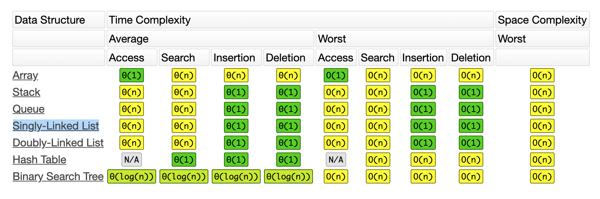

# Data Structures
A data structure is a data organization, management, and storage format that enables efficient access and modification.

  

## Hash Table
#### Implementation: [Link](implementation/HashTable.js)
#### Documentation: [Link](documentation/HashTable.md)

## Linked List (Doubly)
#### Implementation: [Link](implementation/LinkedList.js)
#### Documentation: [Link](documentation/LinkedList.md)

## Binary Search
#### Implementation: [Link](implementation/BinarySearch.js)
#### Documentation: [Link](documentation/BinarySearch.md)

## Stack & Queues
todo
