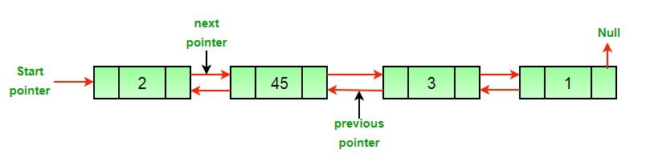

# Data Structures
A data structure is a data organization, management, and storage format that enables efficient access and modification.


## Linked List
##### Check out the [implementation](src/implementation/LinkedList.js) detail.
A linked list is a linear data structure where each element is a separate object. Each element (node) has two items - the data and a reference to the next node. The entry point into a linked list is called the head of the list. The number of nodes in a list is not fixed and can grow and shrink on demand. 

<p align="center">
  
</p>

### Pros:
- Memory Management: no need to specify the size in advance
- Useful if you do a lot of insertions at the beginning of the list - it's faster than array
  - Array: need to shift all the elements by 1 element
  - Linked List: we don't keep track of the postions of the elements

### Cons
- Linked List does not allow direct access to the individual elements. If you want to access a particular item then you have to start at the head and follow the references until you get to that item.
- Another disadvantage is that a linked list uses more memory compare with an array (store reference to the next node).

### Big O Comparisons
| Point             |            Linked List            |                      Array |
| ----------------- | :-------------------------------: | -------------------------: |
| Element Acesss    |     O(n) - sequential access      |       O(1) - direct access |
| Insertion: End    | O(1) with tail; without tail O(n) |                       O(1) |
| Insertion: Start  |               O(1)                |                       O(n) |
| Insertion: Middle |        Search Time + O(1)         |                       O(n) |
| Search Elements   |               O(n)                | O(n) if index is not known |


#### An instance of Linked List class
```
const linkedList = new LinkedList();
```

#### Append new node to the end of Linked List
```
linkedList.appendNode("Apple");
linkedList.appendNode("Banana");
linkedList.appendNode("Orange");
linkedList.appendNode("Potato");
linkedList.appendNode("Grapes");
linkedList.appendNode("Cherries");
linkedList.appendNode("Cherries");
linkedList.appendNode("Cherries");
linkedList.appendNode("Goose");
```

#### Prepend new node to the start of Linked List
```
linkedList.prependNode("Fruit");
```

#### Insert new node before a given node in the Linked List
```
linkedList.insertNodeBefore("Eggs", "Potato");
```

#### Insert new node after a given node in the Linked List
```
linkedList.insertNodeAfter("Eggs", "Potato");
```


## Binary Search
todo


## Stack & Queues
todo
