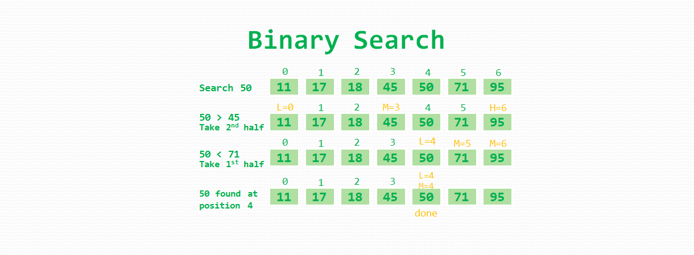

# Binary Search
- A tree is a non-linear or hierarchical data structure.
- Each node has: data and a reference to the next node.
- A node that have no child is called a leaf node.

<p align="center">
  
</p>


## Pros & Cons

### Pros
- It eliminates half of the list from further searching by using the result of each comparison.
- It indicates whether the element being searched is before or after the current position in the list. This information is used to narrow the search.
- For large lists of data, it works significantly better than linear search.

### Cons
- It works only on lists that are sorted and kept sorted. That is not always feasable, especially if elements are constantly being added to the list.


## Big O Comparisons (Average Case)

| Point                         |      Binary Search       |                      Array                    |
| ----------------------------- | :----------------------: | --------------------------------------------: |
| Element Acesss                |         O(log n)         | O(1) - direct access; O(n) - squential access |
| Insertion / Deletion          |         O(log n)         |       O(n) - because of shifting items        |
| Search Elements               |         O(log n)         |       O(n) - unsorted; O(log n) sorted        |
| ----------------------------- | :----------------------: | --------------------------------------------: |


## Applications in real world
- It is used to implement dictionary.
- It is used to implement multilevel indexing in DATABASE.
- It is used to implement searching Algorithm.


## Usage
#### An instance of Binary Search Tree class
```
const bst = new BinarySearchTree(15);
```

#### Insert new node to the BST
```
bst.insertNode(3);
bst.insertNode(36);
bst.insertNode(2);
bst.insertNode(12);
bst.insertNode(28);
bst.insertNode(39);
```

#### Get minimum value node in the BST
```
const minNode = bst.minNode();
```

#### Get maximum value node in the BST
```
const maxNode = bst.maxNode();
```

#### Get total size of the BST
```
const treeSize = bst.size();
```

#### Validate if value is present in the BST
```
const nodeContains = bst.nodeContains(12);
```

### DFS: Branch by Branch

#### In-Order: left, root, right
```
const dfsInOrder = bst.dfsInOrder();
```

#### Pre-Order: root, left, right
```
const dfsPreOrder = bst.dfsPreOrder();
```

#### Post-Order: left, right, root
```
const dfsPostOrder = bst.dfsPostOrder();
```

### BFS: Level by Level
```
const bfs = bst.breadthFirstSearch();
```
